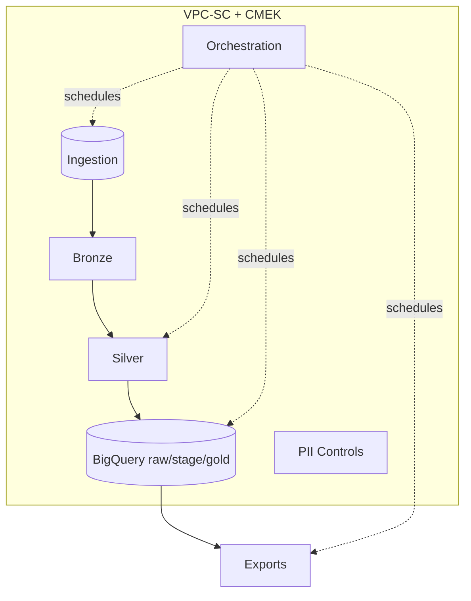

# Regulatory Reporting Lakehouse — Tier-1 Swiss Bank (GCP) · Sanitized Case Study

> **Docs-only, sanitized case study.** No executable code. Names/data are illustrative; patterns are production-style and interview-ready.

> ⚙️ **Note on Structure:**  
> This repository represents a **docs-only case study**.  
> The following folders exist purely as **placeholders** to illustrate a production-grade layout:
>
> - `dbt/` – transformation layer (models, macros, configs)  
> - `composer/` – orchestration DAGs for dataflow jobs and checks  
> - `sql/` – validation or reporting queries used in regulatory pipelines  
>
> These folders contain no executable code in this sanitized version; they are retained to preserve authentic Data Engineering structure.

## L2 Architecture

<!-- L2 Architecture -->

---

## Docs Index
- **Getting Started** → [docs/getting-started.md](docs/getting-started.md)
- **Architecture & Lineage** → [docs/lineage.md](docs/lineage.md)
- **Controls & Compliance** → [docs/controls-and-compliance.md](docs/controls-and-compliance.md)
- **SLOs** → [docs/slo.md](docs/slo.md)
- **Operations Runbook** → [docs/operations-runbook.md](docs/operations-runbook.md)
- **Migration Plan** → [docs/migration-plan.md](docs/migration-plan.md)
- **Exports (Downstream Delivery)** → [docs/exports.md](docs/exports.md)
- **Cost & Performance** → [docs/cost-and-performance.md](docs/cost-and-performance.md)
- **Impact Metrics** → [docs/impact-metrics.md](docs/impact-metrics.md)
- **Glossary** → [docs/glossary.md](docs/glossary.md)
- **FAQ** → [docs/faq.md](docs/faq.md)
- **Risk Log** → [docs/risk-log.md](docs/risk-log.md)
- **Runbooks quick link:** see [RUNBOOK.md](RUNBOOK.md).

> Note: This is a **docs-only** repo. Folders `dbt/`, `composer/`, and `sql/` are placeholders to show production structure.

## Quick Facts

| Area | Choice |
|---|---|
| Cloud | Google Cloud Platform (GCP) |
| Core services (design target) | BigQuery, Cloud Storage, Pub/Sub, Dataflow/Dataproc, Cloud Composer, DLP, KMS, VPC‑SC |
| Workload types | T+1 batch reporting; near-real-time surveillance feeds |
| Data layers | **Bronze** (raw), **Silver** (validated), **Gold** (reg marts/views) |
| Controls | Contracts, DQ, lineage, SLOs, audit trail, PII minimization |
| Compliance mapping | **BCBS 239**, **MiFID II**, **EMIR**, **Basel III** *(illustrative)* |
| Export pattern | **XBRL/CSV + manifest + checksums** handed to **RegOps** |
| Safety | **Docs-only**. Folders `dbt/`, `composer/`, `sql/` are **placeholders** (no runnable artifacts). |

---

## Executive summary
- **Problem:** Legacy reg stacks were siloed and audit-weak.  
- **Solution:** GCP lakehouse blueprint with contracted ingestion, curated gold marts, DQ/lineage, and automated export packs.  
- **Impact (illustrative):** T+1 SLA met; fewer manual exceptions; lower BigQuery scan costs; zero‑touch pipeline replays.

### Program context & timeline
During the parent‑bank integration (2023–2025), statutory filings **remained the duty of the Swiss legal entities** until merger dates. The lakehouse was **designed/overseen under the integration umbrella**. For the Swiss legal entity, the **transformation ran mid‑2023 → mid‑2024**, with **migration and cut‑over in July 2024** ahead of broader rollout.

---

## Repository structure (docs-only)
- `assets/` — Mermaid architecture diagrams.
- `contracts/` — **specs** for datasets & governance (YAML).
- `docs/` — business context, controls, SLOs, lineage, exports, FAQ, runbooks.
  - `docs/patterns/` — **pseudocode** for orchestration, DQ, and gold marts (annotated examples).
- `ADRs/` — architectural decisions.
- `samples/` — tiny, obviously fake deliverable examples (manifest/checksums/CSV).  
- `dbt/`, `composer/`, `sql/` — **placeholders only** (README + .gitkeep).

> This repository intentionally **excludes runnable code**. See `docs/patterns/*` for non‑executable examples.

## Reuse this pattern
- Adapt **contracts** in `contracts/datasets/*.yml`.
- Implement orchestration per `docs/patterns/orchestration.md`.
- Model gold marts from `docs/patterns/gold_marts.md`.
- Export packs via `docs/exports.md` structure.

  ---

### 🧭 Git Study References

This repository includes my personal Git study notes and live command tracker that demonstrate disciplined version control used across all my Data Engineering projects.

| File | Purpose |
| --- | --- |
| [tools/README.md](tools/README.md) | **How this works + daily routine.** One-click or manual flow to append today’s `git ...` commands and push. |
| [docs/git-commands-cheatsheet.md](docs/git-commands-cheatsheet.md) | Comprehensive reference of essential Git commands with context, explanations, and workflow notes. |
| [tools/git-snippets.sh](tools/git-snippets.sh) | Running log of actual Git commands executed during repo setup, experiments, and cleanup tasks. |

> These files show my applied Git workflow discipline — from branching and commits to CI/CD hygiene — following industry practices for production-grade repositories.

## License
MIT.
